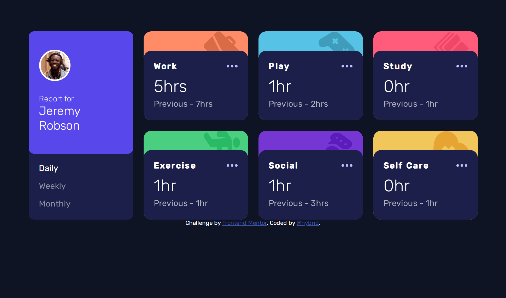

# Frontend Mentor -s Time tracking dashboard solution

This is a solution to the [Time tracking dashboard challenge on Frontend Mentor](https://www.frontendmentor.io/challenges/time-tracking-dashboard-UIQ7167Jw). Frontend Mentor challenges help you improve your coding skills by building realistic projects. 

## Table of contents

- [Overview](#overview)
  - [The challenge](#the-challenge)
  - [Screenshot](#screenshot)
  - [Links](#links)
  - [Built with](#built-with)
  - [Continued development](#continued-development)
  - [Useful resources](#useful-resources)
- [Author](#author)
- [Acknowledgments](#acknowledgments)

## Overview

### The challenge

Users should be able to:

- View the optimal layout for the site depending on their device's screen size
- See hover states for all interactive elements on the page
- Switch between viewing Daily, Weekly, and Monthly stats

### Screenshot

### Links

- Solution URL: [solution URL](https://www.frontendmentor.io/challenges/time-tracking-dashboard-UIQ7167Jw/hub/timetrackingdashboardmain-r1LEVPom5)
- Live Site URL: [live site URL](https://wonderful-madeleine-f01735.netlify.app/)

### Built with

- Semantic HTML5 markup
- CSS custom properties
- Flexbox
- CSS Grid
- Mobile-first workflow
- Vanilla Javascript

### Continued development

I hope to attempt more projects that involve fetching data.
### Useful resources

- [Youtube](https://www.youtube.com/watch?v=qYi-OLf5q5g) - This helped me for the z-index of the section icons. I really liked this pattern and will use it going forward.

## Author
- Frontend Mentor - [@Michaelhybrid](https://www.frontendmentor.io/profile/Michaelhybrid)
- Twitter - [@micheal_olu99](https://twitter.com/micheal_olu99)

## Acknowledgments
To God be the glory.
